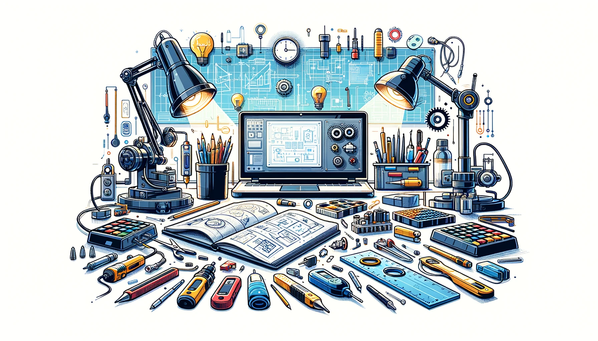

# Bienvenue sur notre documentation

Bienvenue dans la documentation du projet XYZ. Ce site a pour but de fournir toutes les informations nécessaires pour comprendre, utiliser et reproduire efficacement notre projet.

## Résumé du projet

Nous sommes deux étudiants en troisième année d'ingénierie à UniLaSalle Amiens. Dans le cadre de notre formation, nous avons conçu une manette multi-usage capable de contrôler différents appareils via Bluetooth avec un microcontrôleur ESP32.
Nous avons d'abord créé la carte électronique avec KICAD, puis soudé les composants et conçu la coque avec Onshape. Après avoir surmonté des difficultés d'impression 3D, nous avons assemblé la manette et entamé la programmation de l'ESP32 pour assurer une communication stable.
Ce projet nous a permis de renforcer nos compétences en électronique, modélisation 3D et programmation, tout en nous préparant aux défis techniques de l'ingénierie.

## Poster

Voici notre affiche qui présente une vue d'ensemble de notre projet.

## Vidéo

Ici vous publierez la vidéo de votre projet. 
- Moins de 1min30
- Présentation du projet 
- Des explication du fonctionnement du projet
- Des vues du projet / Prototype / Application etc... 
- Des plans du fonctionnement (même basique ou des éléments séparés)
- Une conclusion
Si en stockage local : >50mo

<video src="images/video.mp4" controls title="Title"  style="width: 100%;"></video>

---
